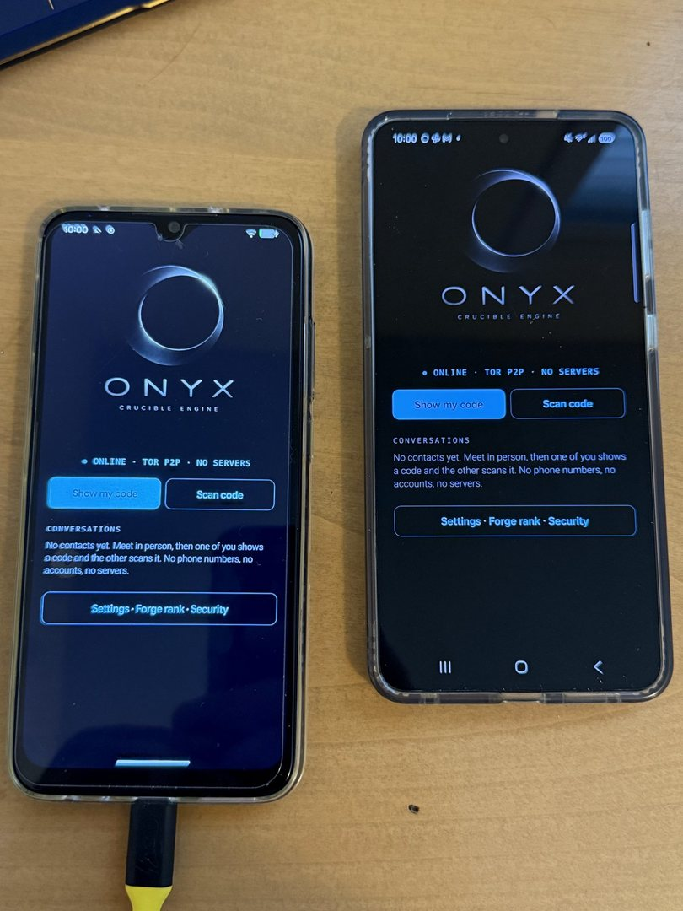
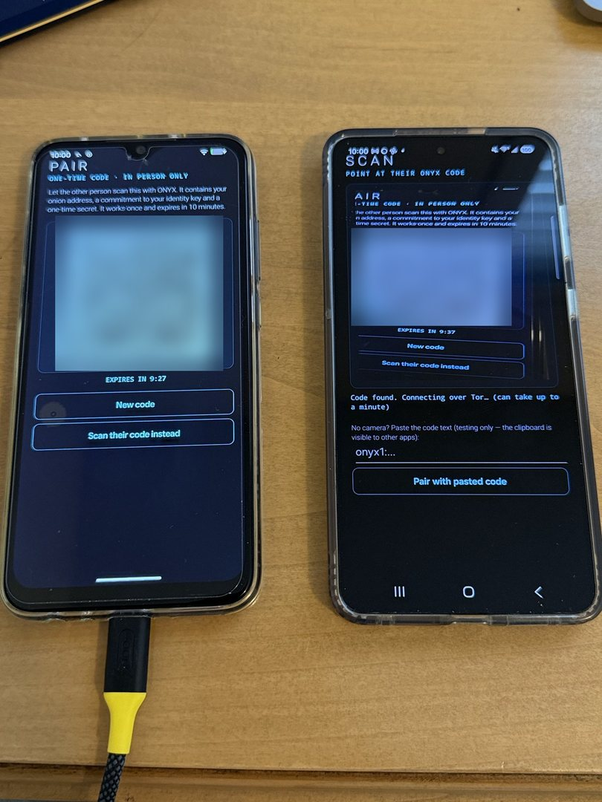
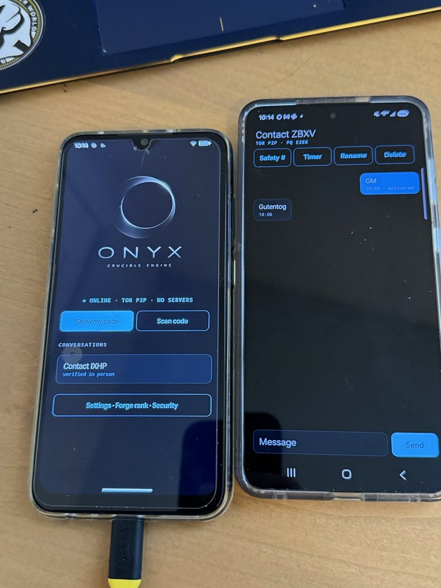
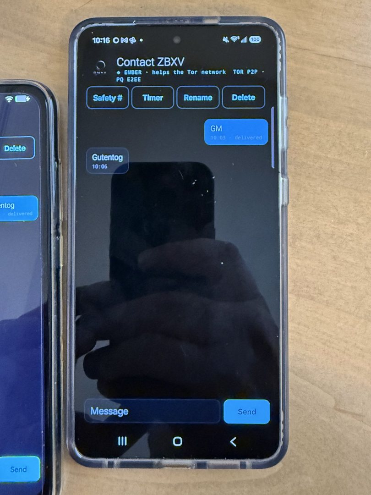
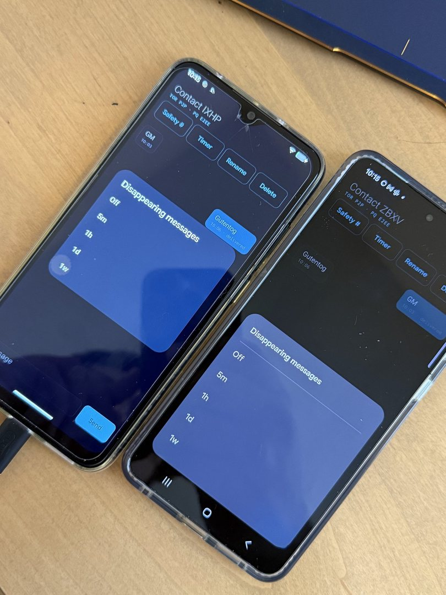
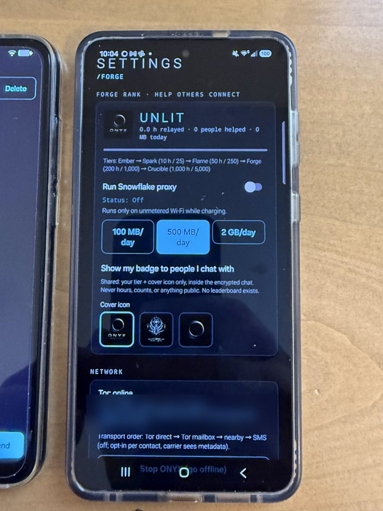
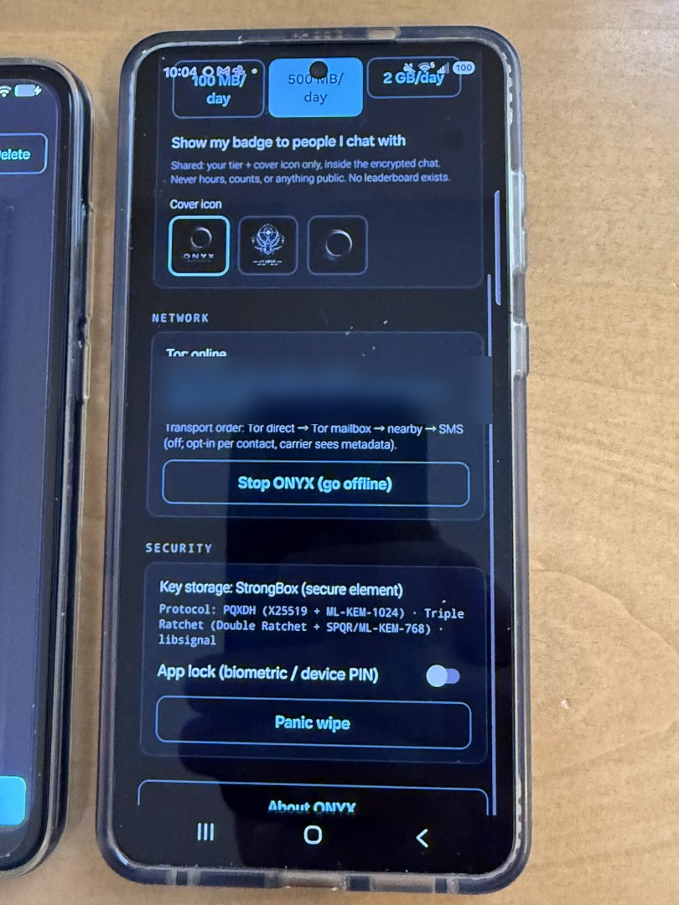
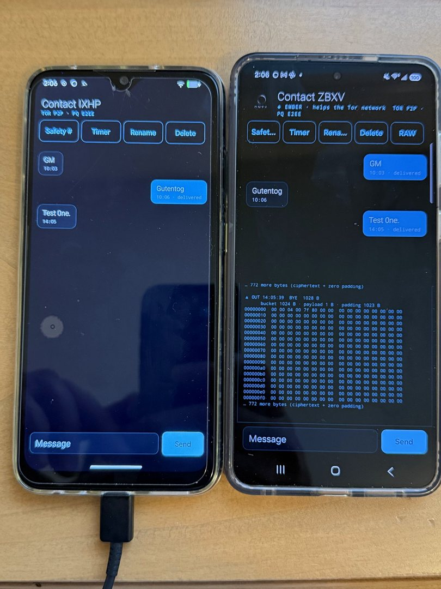
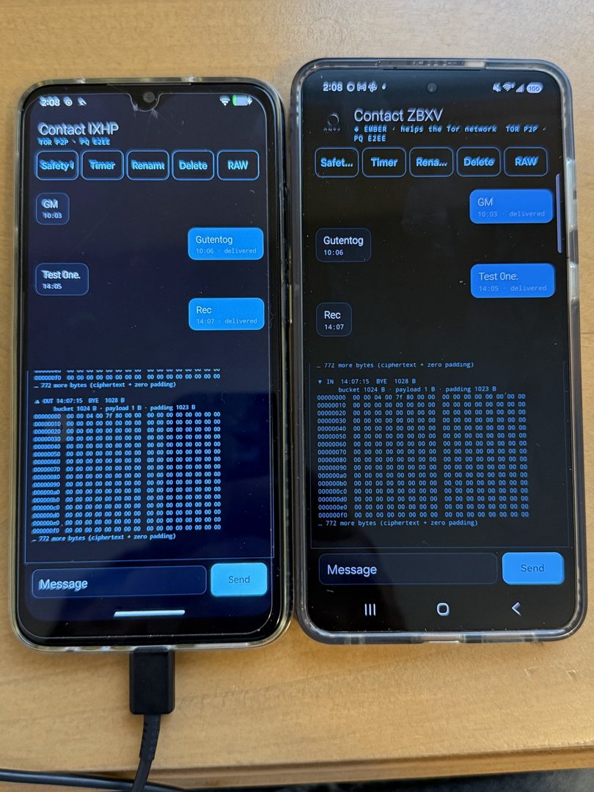

<p align="center">
  
</p>

<p align="center">
  <b>Private messaging with no phone number, no account and no server.</b><br>
  Onion-to-onion over Tor · Post-quantum end-to-end encryption · Nothing in between.
</p>

<p align="center">
  🌐 <a href="https://0nyx.up.railway.app/"><b>ONYX · Private messaging over Tor</b></a> · <a href="https://0nyx.up.railway.app/docs">Docs</a> · <a href="https://0nyx.up.railway.app/#download">Download</a>
</p>

<p align="center">
  <code>Android 11+</code> · <code>AGPL-3.0</code> · <code>No Google services</code> · <code>F-Droid bound</code>
</p>

---

## What is ONYX?

ONYX is an Android messenger that **removes the server entirely**. Every phone runs its own Tor onion service, and messages go directly from one phone to the other. They are end-to-end encrypted with the same post-quantum protocol Signal uses, through Signal's own library, **libsignal**.

You add people **in person** by scanning a one-time QR code, or remotely with a single-use **invite link**. Invite-link contacts stay marked *unverified* until you compare safety numbers.

| | Signal | **ONYX** |
|---|---|---|
| Identifier | Phone number | **None.** A key exchanged in person. |
| Servers | Central servers see IP and timing | **None.** Phone to phone over Tor. |
| Who sees your IP | Signal's servers | **Nobody** |
| Contact discovery | Hashed numbers in a server enclave | **None exists** |
| First-contact check | Optional safety number | **Built into the QR code** |
| Push notifications | Google FCM on stock builds | **None** |
| Message encryption | PQXDH + Triple Ratchet | **PQXDH + Triple Ratchet (libsignal)** |

## Screens

<p align="center">
  
  
  
  
</p>
<p align="center">
  
  
  
</p>
<p align="center">
  
  <br>
  <sub>Left: v1.0 ⇄ v1.1 chatting across versions. Right: the v1.1 RAW view, showing exactly what an interceptor would capture.</sub>
</p>

<sub>Onion addresses and pairing QR codes are blurred in these photos. Never publish yours.</sub>

## Features

- **No identifiers.** No phone number, email, username or profile.
- **Tor peer-to-peer.** Each phone hosts an ephemeral v3 onion service whose key is kept in the encrypted vault, never in Tor's plaintext data directory.
- **Post-quantum E2EE.** PQXDH (X25519 + Kyber-1024) and the Triple Ratchet (Double Ratchet + SPQR/ML-KEM-768), via libsignal.
- **Verified pairing.** The QR code carries a SHA-256 commitment to your identity key, which rules out key substitution during first contact.
- **Invite links.** 24 h, single use and revocable, marked *unverified* until you compare safety numbers.
- **Silent link authentication.** Strangers who find your `.onion` get a closed socket and learn nothing.
- **Size hiding.** Every message and every wire frame is padded to fixed buckets.
- **Hardware vault.** AES-256-GCM with the master key in StrongBox/TEE, HMAC'd index columns and secure delete.
- **Hygiene.** Screenshots blocked, content-free notifications, app lock, disappearing messages, panic wipe.
- **/FORGE rank.** Optionally run a Snowflake proxy to help censored users reach Tor (Wi-Fi and charging only). Your rank is visible only to people you chat with.

## Build

**Requirements:** JDK 17–25 and the Android SDK (Platform 36). Gradle 9.3.1, AGP 9.1.1 and Kotlin 2.3.0 are fetched by the wrapper.

```bash
./gradlew :core:test            # protocol tests, pure JVM
./gradlew :app:assembleDebug    # APKs in app/build/outputs/apk/debug/
```

On Windows PowerShell use `.\gradlew`. Opening the project once in Android Studio creates `local.properties` pointing at your SDK.

## Repository layout

```text
core/       Pure Kotlin/JVM protocol: pairing, frames, padding, onion checks, SOCKS5, SMS codec, Forge rank (+ tests)
app/        Android app: vault, encrypted store, libsignal glue, Tor controller, messenger, UI
site/       Release site + docs (Node, zero dependencies, zero client-side JavaScript), Railway-ready
docs/       Architecture and threat model
fastlane/   F-Droid store listing
```

## Documentation

All docs are also on the website: **[https://0nyx.up.railway.app/docs](https://0nyx.up.railway.app/docs)**

| | |
|---|---|
| [Cryptography](site/docs/04-cryptography.md) | Every key, KDF and MAC, and why it exists |
| [Wire protocol](site/docs/05-protocol.md) | Byte-level layouts of the QR code, frames and pairing messages |
| [Threat model](site/docs/06-threat-model.md) | Who sees what, and what ONYX does **not** protect against |
| [Tor & Snowflake](site/docs/07-tor-and-snowflake.md) | Onion services, SOCKS and the /FORGE rank |
| [Architecture](docs/ARCHITECTURE.md) | Layers, roadmap, dependencies |

## Security

ONYX does **not** implement its own message encryption. It uses libsignal. ONYX's own cryptography (pairing, link auth, padding, storage) uses only standard constructions (HKDF-SHA256, HMAC-SHA256, AES-256-GCM, SHA3-256) and is covered by tests against published vectors.

Found a vulnerability? Please report it privately through **GitHub Security Advisories** on this repository ("Report a vulnerability") rather than in a public issue.

## Dependencies

| Library | Purpose | License |
|---|---|---|
| [libsignal](https://github.com/signalapp/libsignal) | PQXDH, Triple Ratchet | AGPL-3.0 |
| [tor-android](https://github.com/guardianproject/tor-android) + jtorctl | Embedded Tor | BSD-3 |
| [IPtProxy](https://github.com/tladesignz/IPtProxy) | Snowflake proxy | MIT / BSD |
| [ZXing](https://github.com/zxing/zxing) | QR codes | Apache-2.0 |

No Google Play Services, Firebase, analytics or crash reporting.

## License

**AGPL-3.0-only** (required by libsignal). See [LICENSE](LICENSE).

---

<p align="center">
  <br>
  <sub>DESIGN BY</sub><br>
  <b>SirRogersJackBlood</b>
</p>
